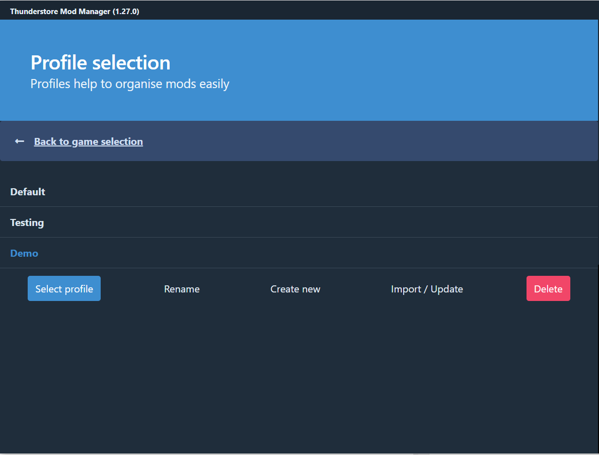
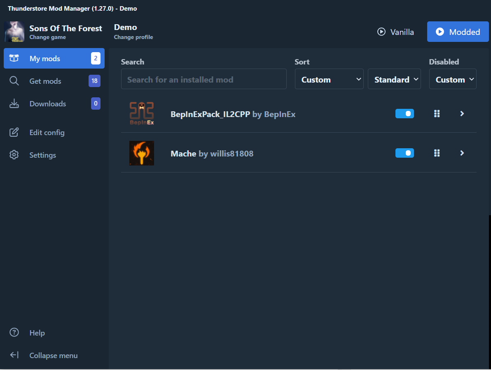
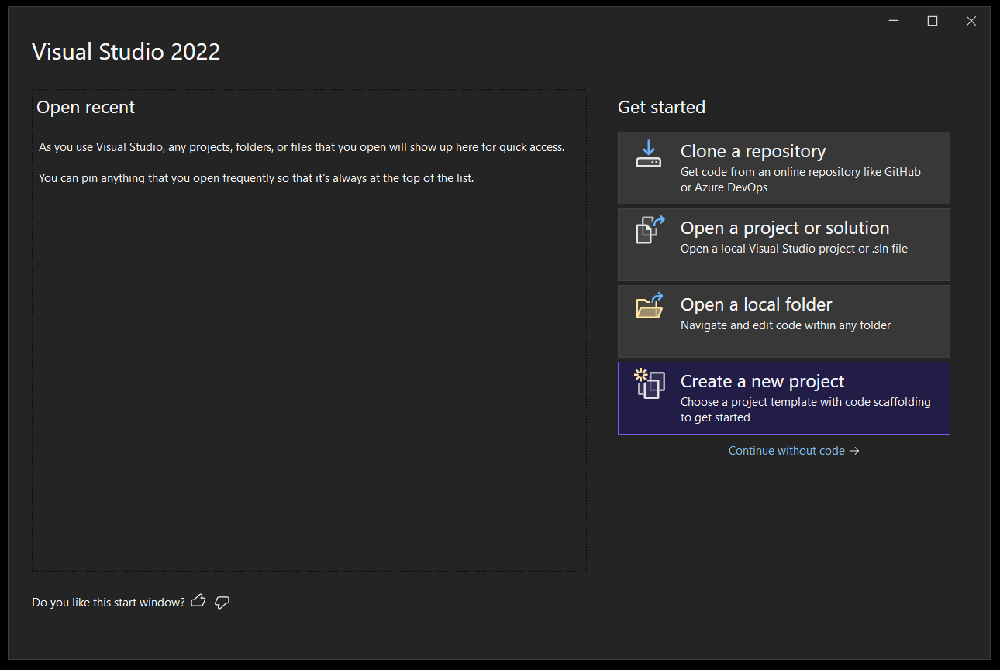

# Hello World Mache Plugin
This repository is to help you get setup to run a Sons Of The Forest(SOTF) Mod in [Mache](https://github.com/willis81808/Mache).  


## Prerequisites
1. Download and Install [Visual Studio](https://visualstudio.microsoft.com/)
2. Download and Install [Thunderstore Mod Manager](https://www.overwolf.com/app/Thunderstore-Thunderstore_Mod_Manager)
3. Purchase and Install SOTF on Steam

## Setting Up Thunderstore
Upon opening Thunderstore Mod Manager(TMM) you will have to select a game. Search and choose "Sons Of The Forest".  
  

Hover over the title and select "Set as Default". This will allow it to load into SOTF each time the application is loaded.  
Next you will see the Profiles page. You can use the Default one or create your own. We will create a new Profile "Demo" for this.  
  

Make sure the profile you want is blue then click "Select Profile".  
This will open your TMM Game Mod Menu!  
First lets try to run the game vanilla. (Click "Vanilla" at the top right).  
  

If there is an issue running your game, click on Settings, verify that the following settings are appropriate for your computer:  
* Change Sons Of The Forest directory
* Change Steam directory  
  


If you game did launch successfully, now we can add some mods!
Lets get Mache downloaded. (This should pull in the other depenency with it (BepInExPack_IL2CPP).  
  


TMM is now ready for us to use!  
  

**Run SOTF with the Mods (Modded)** and once you load into a save press 'F1' to see the Mache menu then exit the game.  


## Creating, Building and Using The Visual Studio Project
Once Visual Studio (VS) is installed, open the application. We should go to a landing page.  
  

Click Create a New Project.  
Search or scroll for "Class Library (.NET Framework)" and click Next.  
  

Provide a Name, Location and Framework for your project and click Create!  
  

Rename your generated class file to be the name of your plugin.  
  

Add your references; we will be using the TMM Data. 
On the Right side of your IDE, Right Click References and select Add Reference.  
  

Select "Browse" on the left side, the click "Browse..." at the bottom.  
  

Traverse to your TMM Folder:  
`C:\Users\userId\AppData\Roaming\Thunderstore Mod Manager\DataFolder\SonsOfTheForest\profiles\Demo\BepInEx`   
  

Couple of notes here. First if you did not execute the game in the Modded Mode, the necessary files will not exist here. 
Second if you cannot traverse to your AppData folder, enable "Hidden Items" in your windows explorer. 

Here are a list of the DLLs you will need and there Directory with respsect to the "BepInEx" parent directory:  

| DLL Name | Path |
| -------- | ------- |
|BepInEx.Core|\core\BepInEx.Core.dll|
|BepInEx.Unity.IL2CPP|\core\BepInEx.Unity.IL2CPP.dll|
|Il2CppInterop.Runtime|\core\Il2CppInterop.Runtime.dll|
|Il2Cppmscorlib|\interop\Il2Cppmscorlib.dll|
|UnityEngine|\interop\UnityEngine.dll|
|UnityEngine.CoreModule|\interop\UnityEngine.CoreModule.dll|
|Mache|\plugins\willis81801-Mache\Mache.dll|
|UniverseLib.IL2CPP.Interop|\plugins\willis81801-Mache\UniverseLib.IL2CPP.Interop|

  

Once you have selected all of these References, CLick Okay.  
  


Now we will write the plugin!
First is the MonoBehaviour
```
public class HelloWorld : MonoBehaviour
{
    private void Start() 
    {
        Mache.Mache.RegisterMod(() => new ModDetails
        {
            Id = HelloWorldMachePlugin.ModId,
            Version = HelloWorldMachePlugin.Version,
            Name = HelloWorldMachePlugin.ModName,
            Description = "This text will show up in the Mache Framework Menu.",
            OnFinishedCreating = CreateMenu,
        });
    }

    private void CreateMenu(GameObject parent)
    {
        MenuPanel.Builder()
            .AddComponent(new LabelComponent
            {
                Text = "Hello World Mache Text will show up as a label.",
                FontSize = 20
            })
            .BuildToTarget(parent);
    }

    private void Update() { }
}
```

Next is the Base Plugin with the BepInEx Annotations. 
```
[BepInDependency("com.willis.sotf.mache")]
[BepInPlugin(ModId, ModName, Version)]
[BepInProcess("SonsOfTheForest.exe")]
public class HelloWorldMachePlugin : BasePlugin
{
    public const string ModId = "com.pankakes.sotf.helloworldmache";
    public const string ModName = "Hello World Mache";
    public const string Version = "0.0.1";

    internal static HelloWorldMachePlugin Instance { get; private set; }

    public override void Load()
    {
        Instance = this;
        AddComponent<HelloWorld>();
    }
}
```

Both of these classes will go in your Namespace. 
And thats it! Now we have to build the solution.
At the top of your IDE, click Build -> Build Solution.  
  

And your project should build successfully!  
  


## Importing Your Mod Into Thunderstore Mod Manager
In TMM, click on Settings and find "Import local mod".  
  

Navigate to your projects "obj\Debug" folder: `..\HelloWorldMache\HelloWorldMache\obj\Debug`.  
Select your DLL. Fill out the data, or not, and click Import at the bottom.  
  

Next we will run SOTF Modded in TMM.  
  


## The End
And thats it. Hopefully you found this guide helpful.  
If you have any other questions reach out to the [SOTF Modding Discord Server](https://discord.gg/bwYmAqRPmd). 